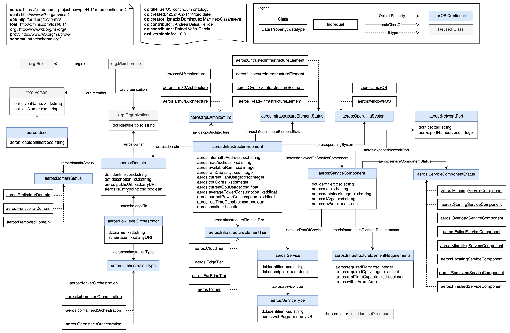
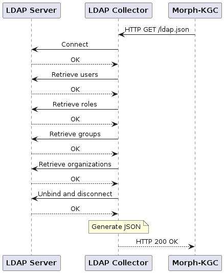

# LDAP Collector

The LDAP Collector is a Python application based on the [`ldap3`](https://ldap3.readthedocs.io/en/latest/), [FastAPI](https://fastapi.tiangolo.com/) and [Uvicorn](https://www.uvicorn.org/) libraries.

It connects to an LDAP server, retrieves information of users, roles, groups and organizations and generates a JSON object which can be used later by Morph-KGC to generate RDF triples given the appropriate mappings file. An example of this JSON output is available [here](examples/ldap.json).

The YARRRML mappings file can be found [here](examples/mappings.yaml), whereas its RML equivalent is [here](examples/mappings.ttl). These mappings have been defined according to the aerOS Continuum Ontology, which diagram is included below:



The LDAP Collector is a neccesary component for integrating LDAP data into the knowledge graph.

The generation and retrieval of the JSON object is requested via a REST API method (`HTTP GET /ldap.json`) that the collector exposes. A sequence diagram that describes the working principle of the collector is included below:



## Current versions:
- **LDAP Collector application**: 2.2.1 (February 6th, 2025).
- **Dockerfile**: 2.2.1 (February 6th, 2025).
- **Kubernetes manifest file**: 2.2.1 (February 6th, 2025).

## Building the Docker image

The collector is meant to be run as a Docker container, hence a [`Dockerfile`](Dockerfile) is provided.

A pre-built image of the LDAP Collector is available. You can pull it using this command:

```bash
$ sudo docker pull ghcr.io/candil-data-fabric/ldap-collector:latest
```

If you prefer to build the image yourself, simply run the following command:

```bash
$ sudo docker build -t ldap-collector:latest .
```

**NOTE:** The collector will serve HTTP GET requests on port 63300 (TCP).

## Running the collector

### Configuration
The collector is configured using the following environmental variables:

|      **Variable**     |                                                                                   **Description**                                                                                   |
|:---------------------:|:-----------------------------------------------------------------------------------------------------------------------------------------------------------------------------------:|
|  `LDAP_ORGANIZATION_DN` |                                                               LDAP DN of the organization to retieve information from.                                                               |
|  `LDAP_SERVER_ENDPOINT` | URI where the LDAP server is listening from incoming connections or requests. FORMAT: `ldap(s)://<ip_or_fqdn>:<port>`. LDAP (unencrypted) port is 389. LDAPS (encrypted) port is 636. |
|      `LDAP_USE_SSL`     |                                                            Whether or not to use SSL for the connection with the server.                                                            |
|       `LDAP_USER`       |                                                    LDAP DN of the user for connecting with the server and retrieving information.                                                   |
|     `LDAP_PASSWORD`     |                                                   Password of the user for connecting with the server and retrieving information.                                                   |
| `LDAP_CONN_MAX_RETRIES` |                                                Maximum number of retries while trying to establish a connection with the LDAP server.                                               |
|   `LDAP_CONN_TIMEOUT`   |                                        Time (in seconds) to wait between retries while trying to establish a connection with the LDAP server.                                       |

### Docker Compose
If you choose to deploy the collector using Docker Compose, you can define the service using the following directives:

```yaml
ldap-collector:
    image: ghcr.io/candil-data-fabric/ldap-collector:latest
    hostname: ldap-collector
    container_name: ldap-collector
    ports:
        - "63300:63300"
    environment:
        - LDAP_ORGANIZATION_DN="dc=example,dc=com"
        - LDAP_SERVER_ENDPOINT="ldap://openldap:389"
        - LDAP_USE_SSL="False"
        - LDAP_USER="cn=admin,dc=example,dc=com"
        - LDAP_PASSWORD="adminpassword"
        - LDAP_CONN_MAX_RETRIES="5"
        - LDAP_CONN_TIMEOUT="5"
```

### Kubernetes manifest file

Should you need to change the configuration, simply edit the values of the environmental variables defined in the [manifest file](kubernetes/ldap-collector.yaml).

To deploy the collector, run the following command at the `./kubernetes` directory:

```bash
$ kubectl apply -f ldap-collector.yaml
```

To delete the deployment, run the following command, also at the `./kubernetes` directory:

```bash
$ kubectl delete -f ldap-collector.yaml
```
